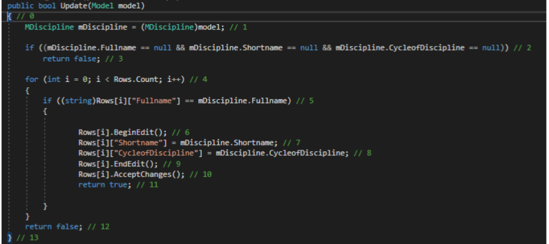

# Тестируемый метод

# Управляющий граф

# Маршруты на основании управляющего графа.

R1 = 0 - 1 - 2a - 2b - 2c - 4 - 5 - 6 - 7 - 8 - 9 - 10 - 11 - 13

R2 = 0 - 1 - 2a - 2b - 2c - 3 - 13

R3 = 0 - 1 - 2a - 2b - 2c - 4 - 12 - 13

# Таблица тестирования 

| Test ID | Region | Test title | Input model | Expected result | Actual result | Test status (Passed/Failed)|
| --- | --- | --- | --- | --- | --- | --- |
| task-337-1 | R2 | Ввод корректных данных в таблицу | “Fullname”:“Математика" "Shortname":"Физ." "CycleOfDiscipline":"33" | true | true | Passed |
| task-337-2 | R1 | Ввод null-значений | “Fullname”: null "Shortname": null "CycleOfDiscipline":null | false | false | Passed |
| task-337-3 | R3 | Попытка обновления данных, которых не существует | “Fullname”:“Абвг” "Shortname":"Физ." "CycleOfDiscipline":"33" | false | false | Passed|

# Вывод

Метода тестирования “Белый ящик” помог более наглядно рассмотреть структуры построения дисциплины и стал полезен для тщательного тестирования и обнаружения проблем. 
Оптимизация кода стала более легкой и тестирование прошло успешно.

